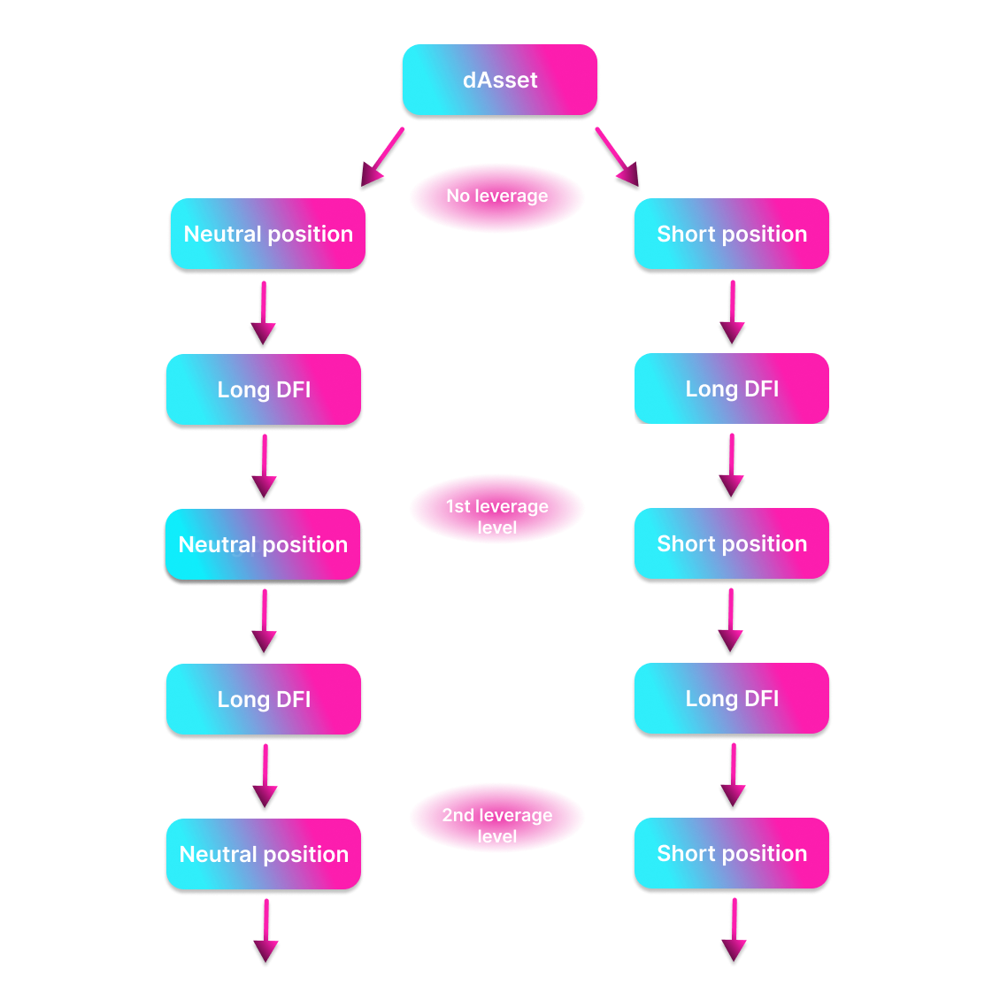
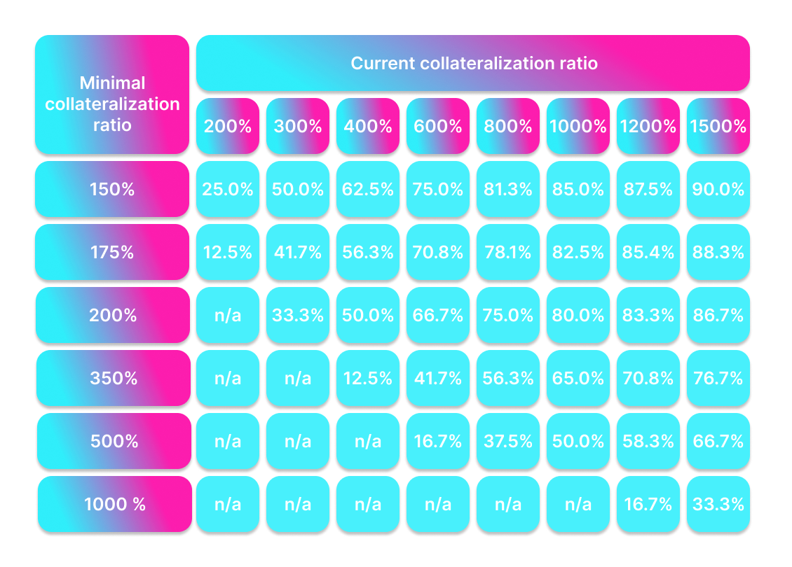

There are many advanced investing & trading methods. This chapter describes two different ways of using the leverage depending on the investment strategy.

The examples are made for the input investment of DFI, but it can be replaced with all crypto tokens of DeFiChain ecosystem (f.e. dBTC, dETH, dUSDT,...). However, only dAsset-DUSD pools are used in the examples.

### Leverage Long DFI / Neutral dAsset (Stablecoin)

#### Investment thesis

- the future price of DFI will be higher than it is today and leverage provides more then linear increase of profit.

#### DefiChain procedure

- put **X amount of DFI** in vault as the collateral for a decentralized loan and mint **DUSD**
- sell **DUSD** for **DFI** at price **A**
- for leverage repeat the procedure
- The Goal of the investment
  - sell **DFI** for **DUSD**(when the DFI price increase to **B**)
  - close the loan by putting DUSD (interest included) back (repeat for each level of leverage)
    Profit (1st level of leverage): **(B-A) \* X \* (1 + (1 / collateralization ratio)) - loan interest**

#### Remarks

- trades (losses and gains) are measured in DUSD = $1
- the price of dAssets comes from the liquity minig pools, not from the price feed of the Oracles **→ pay attention to the pool ratio**
- not all capital is invested (2/3 – 1/10 with respect to collateral ratio)
- for effective leverage a low collateralization near 150% is needed, that may cause multiple liquidation risks if the price of collaterals falls too low. **→ pay attention to the collateral ratio**

:::info Example

When **DFI** price is **$2.50** it can be bought **300 DFI** for **$750**, which provides decentralized loan of **500 DUSD** (150% collateralization).
**500 DUSD** can be swapped to **200 DFI** (1st level of leverage), which added to the collateral provides **333.33' DUSD** loan, which can be swapped again to **133.33' DFI** (2nd level of leverage).

When **DFI** price goes up to **$4.00**, then **133.33 DFI** can be swapped to **533.33' DUSD**. Loan payback (interest included) is **350 DUSD**, which provides **$183.33 profit** and release **200 DFI**, which can be swapped to **800 DUSD**. Loan payback (interest included) is **525 DUSD**, which provides **$275 profit** and release **300 DFI** which can be swapped to **$1200**.

**Overall profit for 2nd level of leverage: $450 + $275 + $183.33 = $908.33**  
(profit without leverage: $450)

**→ The best case for this investment: the DFI price increases (and never drops to liquididation level).**

:::

### Leverage Long DFI / Short dAsset

#### Investment thesis

- the future price of DFI will be higher than it is today and leverage provides more then linear increase of profit.
- at the same time the dAsset price decreases.

#### DefiChain procedure

- put **X amount of DFI** in vault as the collateral for a decentralized loan and mint **dAsset**
- sell **dAsset** for **Y amount of DUSD**
- buy **DFI** at price **A** with **DUSD**
- for leverage repeat the procedure
- The Goal of the investment
  - sell **DFI** for **DUSD**(when the DFI price increase to **B**)
  - buy **dAsset** for **Z amount of DUSD**
  - close the loan by putting **dAsset** (interest included) back (repeat for each level of leverage)
    Profit (1st level of leverage): **(B-A) \* X \* (1 + (1 / collateralization ratio)) + (Y - Z) - loan interest**

#### Remarks

- trades (losses and gains) are measured in DUSD = $1
- the price of dAssets comes from the liquity minig pools, not from the price feed of the Oracles **→ pay attention to the pool ratio**
- not all capital is invested (2/3 – 1/10 with respect to collateral ratio)
- betting on two tokens (DFI and dAsset) may provide more profit but also the risk is increased **→ beware of price volatility**
- for effective leverage a low collateralization near 150% is needed, that may cause multiple liquidation risks if the price of collaterals falls too low. **→ pay attention to the collateral ratio**

:::info Example

When **DFI** price is **$2.50** it can be bought **300 DFI** for **$750**, which provides decentralized loan of **0.5 dTSLA** (150% collateralization, 1dTSLA = $1000).
**0.5 dTSLA** can be swapped to **500 DUSD** for which can be swapped to **200 DFI** (1st level of leverage).

When **DFI** price goes up to **$4.00** and **dTsla** fals to **$500**, then **200 DFI** can be swapped to **800 DUSD**, which provides **$300 profit**. Loan payback (interest included) is **dTSLA worth of 262.5 DUSD**, which provides **$273.5 profit** and release **300 DFI** which can be swapped to **$1200**.

**Overall profit for 1st level of leverage: $450 + $237.5 + $300 = $987.5**  
(profit without leverage: $450)

**→ Best case for this investment: DFI price goes up and dAsset price goes down**

:::

### Leverage of DFI – Liquidation risk

If the value of collateral might drop below the defined loan level, it has to be increased. Otherwise loan will be auctioned off. Using a combination of DFI and some stable coins like DUSD, USDC or USDT as a collateral can reduce the risk, because they are stable against US-Dollar.

For a better understanding and comparabillity some figures are introduced below.

Token value: **V**  
Collateral value: **C**  
Current collateral ratio: **r = C / V**  
Minimum collateral ratio: **L**

To avoid liquidation the following inequality must always be fullfilled:  
**L <= r**

The level of overcollateralization is representedd by **x**:  
**L = r \* x → x = L / r**

How much can current collateral ratio drop, can be derived:  
**d = 1 - x = 1 - (L / r)**

:::info Example

When the **DFI** price is **$2.50**, then **100 DFI** is worth of **$250** and provides **dAsset loan** worth of **$100** (collateralization ratio 200%). **The Collateral** must stay above **$200** to avoid liquidation.

→ Possible reduction of collateral value before liquidation:
**d = 1 - (200% / ($250 / $100)) = 1 - (200% / 250%) = 20%**

:::

Depending on the current (planned) collateral ratio, it can be decided which minimum collateral ratio fits to the strategy compared to the risk of liquidation. It should be considered, that the lower collateral ratios bring higher interest.

**The "allowed" decrease of collateral value for common schemes is evaluated in the table below. ↓**

### Leverage of DFI – Level of Leverage

The leverage level depends on the number of iterativly created loans and converges to a fix ratio. This depends on the used collateralization ratio.

:::info Example

When the **DFI** price is **$2.50**, then **400 DFI** is worth of **$1000** and provides **500 DUSD loan** (collateralization ratio 200%). Those **500 DUSD** can be swapped for **200 DFI** must stay above **$200**. The input investment of **400 DFI** provides holdings of **600 DFI**.

Then the leverage factor is: **600 / 400 = 1.5**

:::

**The table with leverage factors for different collateralization ratio can be seen below ↓**

**→ For effective leveraging is needed a low collateralization ratio, which will be near the liquidation level - higher risk!**
